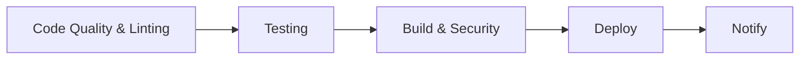

# CI/CD Pipeline Documentation

This document describes the comprehensive CI/CD pipeline for bryanjhickey.com, built with GitHub Actions and integrated with the testing infrastructure.

## 🚀 Pipeline Overview

The CI/CD pipeline consists of 5 main workflows that ensure code quality, security, and reliable deployments:

1. **CI/CD Pipeline** - Main build, test, and deployment workflow
2. **Pull Request Checks** - Enhanced PR validation and analysis
3. **Security & Dependencies** - Automated security monitoring
4. **Release & Deploy** - Automated versioning and production deployment
5. **Documentation** - Documentation generation and maintenance

## 🔄 CI/CD Pipeline

**Trigger**: Push to `main`/`develop`, Pull Requests  
**File**: `.github/workflows/ci.yml`

### Pipeline Stages



#### Stage 1: Code Quality & Linting

- **ESLint**: Code style and quality checks
- **TypeScript**: Type checking with strict mode
- **Sanity Types**: Auto-generated type validation
- **Caching**: Dependencies cached for faster builds

#### Stage 2: Testing

- **Unit Tests**: Comprehensive component testing with Vitest
- **Integration Tests**: API route testing
- **Accessibility Tests**: Automated a11y compliance with jest-axe
- **Coverage**: Code coverage reporting with thresholds (80%+)
- **Codecov Integration**: Coverage tracking and reporting

#### Stage 3: Build & Security

- **Production Build**: Next.js build with optimization
- **Security Audit**: Dependency vulnerability scanning
- **Build Caching**: Optimized build artifact caching

#### Stage 4: Deploy (Production Only)

- **Environment**: `production` environment with approvals
- **Conditions**: Only on `main` branch push
- **Ready for Integration**: Supports Vercel, Netlify, custom servers

#### Stage 5: Notification

- **Status Reporting**: Success/failure notifications
- **Always Runs**: Provides final pipeline status

## 🔍 Pull Request Checks

**Trigger**: PR opened, synchronized, reopened  
**File**: `.github/workflows/pr.yml`

### Enhanced PR Features

#### 1. PR Analysis & Validation

- **Comprehensive Checks**: Linting, type checking, testing, build validation
- **Automated Comments**: Detailed results posted as PR comments
- **Report Generation**: Detailed reports for each check
- **Skip Draft PRs**: Only runs on ready-for-review PRs

#### 2. Accessibility Testing

- **Dedicated A11y Tests**: Focused accessibility compliance testing
- **Failure Notifications**: Automatic comments on accessibility failures
- **WCAG Compliance**: Ensures all components meet accessibility standards

#### 3. Bundle Size Analysis

- **Build Analysis**: Bundle size monitoring and optimization
- **Performance Tracking**: Identifies bundle bloat and optimization opportunities
- **Artifact Upload**: Bundle analysis reports for review

### PR Comment Example

```markdown
## 🔍 PR Analysis Results

### 📝 ESLint Results

✅ No linting issues found

### 🔧 TypeScript Results

✅ No type errors found

### 🧪 Test Results

✅ All tests passing

### 🏗️ Build Results

✅ Build successful

---

_This comment was generated automatically by the CI/CD pipeline_
```

## 🛡️ Security & Dependency Checks

**Trigger**: Daily schedule, dependency changes, manual dispatch  
**File**: `.github/workflows/security.yml`

### Security Features

#### 1. Vulnerability Scanning

- **Daily Audits**: Automated security vulnerability detection
- **Issue Creation**: Automatic GitHub issues for vulnerabilities
- **Severity Tracking**: Prioritized vulnerability reporting
- **Report Artifacts**: Detailed security reports

#### 2. Dependency Health

- **Outdated Packages**: Monitoring for dependency updates
- **Version Validation**: Detection of problematic version specifiers
- **Health Metrics**: Comprehensive dependency analysis

#### 3. License Compliance

- **License Scanning**: Automated license compatibility checking
- **Compliance Reports**: Detailed license analysis
- **Risk Assessment**: Identification of problematic licenses

#### 4. Code Quality Metrics

- **Test Coverage**: Comprehensive coverage analysis
- **Code Metrics**: Lines of code, file counts, complexity analysis
- **Quality Trends**: Historical quality tracking

## 🚢 Release & Deploy

**Trigger**: Git tags (`v*.*.*`), manual dispatch  
**File**: `.github/workflows/release.yml`

### Release Process

#### 1. Automated Release Creation

- **Tag-based Releases**: Semantic versioning support
- **Release Notes**: Auto-generated changelogs
- **Contributor Recognition**: Automatic contributor listing
- **Release Archives**: Downloadable release packages

#### 2. Production Deployment

- **Environment Protection**: Production environment with approvals
- **Full Pipeline**: Complete test suite before deployment
- **Platform Ready**: Support for multiple deployment targets

#### 3. Deployment Validation

- **Health Checks**: Post-deployment validation
- **Performance Monitoring**: Automated performance checks
- **Rollback Support**: Failure detection and rollback procedures

### Supported Deployment Platforms

```yaml
# Vercel Example
- name: Deploy to Vercel
  uses: amondnet/vercel-action@v25
  with:
    vercel-token: ${{ secrets.VERCEL_TOKEN }}
    vercel-org-id: ${{ secrets.VERCEL_ORG_ID }}
    vercel-project-id: ${{ secrets.VERCEL_PROJECT_ID }}

# Netlify Example
- name: Deploy to Netlify
  uses: nwtgck/actions-netlify@v3.0
  with:
    publish-dir: ".next"
    production-branch: main

# Custom Server Example
- name: Deploy to server
  uses: appleboy/ssh-action@v1.0.0
  with:
    host: ${{ secrets.HOST }}
    script: |
      cd /path/to/app
      git pull origin main
      bun install --frozen-lockfile
      bun run built
      pm2 restart app
```

## 📚 Documentation & Maintenance

**Trigger**: Code changes, schedule, manual dispatch  
**File**: `.github/workflows/docs.yml`

### Documentation Features

#### 1. Auto-Generated Documentation

- **Component Docs**: Automatic component documentation
- **API Documentation**: API route documentation
- **Coverage Reports**: Test coverage documentation
- **Architecture Docs**: System architecture documentation

#### 2. README Maintenance

- **Metrics Badges**: Automated project metrics
- **Status Updates**: Build and test status badges
- **Statistics**: Real-time project statistics
- **Auto-commit**: Automatic documentation updates

#### 3. Documentation Health

- **Completeness Checks**: Documentation coverage analysis
- **Health Reports**: Documentation quality assessment
- **Recommendations**: Improvement suggestions

## 🔧 Configuration & Setup

### Required Secrets

Add these secrets in GitHub Repository Settings:

```bash
# Sanity CMS
NEXT_PUBLIC_SANITY_PROJECT_ID=your-project-id
NEXT_PUBLIC_SANITY_DATASET=production
NEXT_PUBLIC_SANITY_API_VERSION=2024-01-01
SANITY_API_READ_TOKEN=your-read-token

# Deployment
NEXT_PUBLIC_SITE_URL=https://your-domain.com

# Coverage (Optional)
CODECOV_TOKEN=your-codecov-token

# Deployment Platform (Choose one)
VERCEL_TOKEN=your-vercel-token
VERCEL_ORG_ID=your-org-id
VERCEL_PROJECT_ID=your-project-id

# OR Netlify
NETLIFY_AUTH_TOKEN=your-netlify-token
NETLIFY_SITE_ID=your-site-id

# OR Custom Server
HOST=your-server-host
USERNAME=your-username
KEY=your-ssh-private-key
```

### GitHub Environments

Set up these environments in GitHub:

1. **production**
   - **Protection Rules**: Require manual approval
   - **Secrets**: Production-specific secrets
   - **Branches**: Only `main` branch

### Local Development Integration

The CI/CD pipeline integrates seamlessly with local development:

```bash
# Run the same tests locally
bun test                    # Watch mode
bun run test:run           # Single run
bun run test:coverage      # With coverage
bun run test:ci           # CI mode

# Quality checks
bun run lint              # ESLint
bun run typecheck         # TypeScript
bun run built             # Build check
```

## 📊 Pipeline Metrics & Monitoring

### Performance Targets

- **Build Time**: < 5 minutes
- **Test Execution**: < 2 minutes
- **Deploy Time**: < 3 minutes
- **Total Pipeline**: < 10 minutes

### Quality Gates

- **Test Coverage**: ≥ 80%
- **TypeScript**: 100% strict compliance
- **ESLint**: Zero violations
- **Accessibility**: 100% compliance
- **Security**: Zero high/critical vulnerabilities

### Monitoring & Alerts

- **Failed Builds**: Immediate notifications
- **Security Issues**: Daily monitoring with issue creation
- **Coverage Drops**: Coverage threshold enforcement
- **Deployment Failures**: Automatic rollback consideration

## 🚀 Best Practices

### Development Workflow

1. **Feature Branches**: Create feature branches from `develop`
2. **Pull Requests**: Always use PRs for code review
3. **CI Validation**: Ensure all CI checks pass
4. **Manual Testing**: Test functionality before merging
5. **Release Process**: Use semantic versioning for releases

### CI/CD Optimization

1. **Caching**: Leverage build and dependency caching
2. **Parallel Jobs**: Run independent jobs in parallel
3. **Conditional Execution**: Skip unnecessary jobs when possible
4. **Resource Management**: Optimize job resource usage
5. **Security**: Never expose secrets in logs

### Troubleshooting

1. **Check Logs**: Review detailed workflow logs
2. **Local Reproduction**: Reproduce issues locally first
3. **Secrets Validation**: Verify all required secrets are set
4. **Dependency Issues**: Check for dependency conflicts
5. **Environment Parity**: Ensure local/CI environment consistency

## 📈 Future Enhancements

### Planned Improvements

- **E2E Testing**: Playwright integration for end-to-end testing
- **Visual Regression**: Screenshot comparison testing
- **Performance Budgets**: Lighthouse CI integration
- **Dependency Updates**: Automated dependency update PRs
- **Multi-environment**: Staging environment support
- **Notifications**: Slack/Discord integration for deployments

### Monitoring Enhancements

- **Real User Monitoring**: Production performance tracking
- **Error Tracking**: Sentry or similar error monitoring
- **Analytics Integration**: Deployment success tracking
- **Cost Monitoring**: CI/CD cost optimization

---

This CI/CD pipeline provides enterprise-grade automation, quality assurance, and deployment capabilities while maintaining simplicity and reliability. The modular design allows for easy customization and extension based on project needs.
